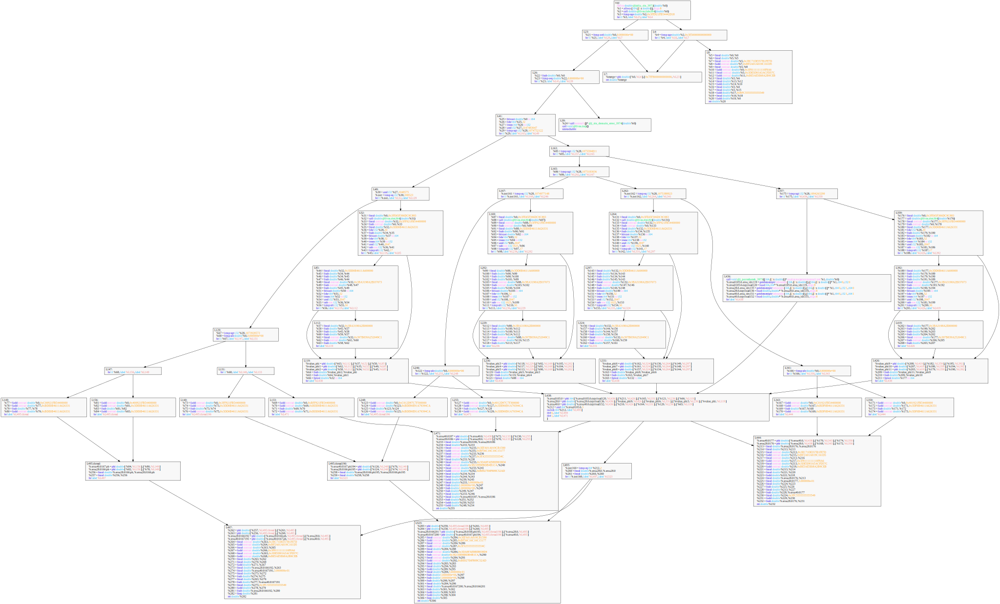

# IRViewer.jl

IRViewer.jl is a small package for visualization of Julia's LLVM IR.
## Installation
You must have `graphviz` installed on your computer. Enter `dot -v` in command line to test whether you have installed it. Then use `Pkg` install this package.
## Usage
Currently `IRViewer` exports two macros, `@llvmir2html` and `@llvmir2svg`, to generate `html` and `svg` outout format. These two macros act like `code_llvm`. So you can use `@llvmcall sin(1.0)` to get the llvm ir of method `sin(::Float64)`. Note that currently they only support simple function calls, `arr[i] = 1` and other syntax sugers are not supported. You must explicitly use `getindex` and `setindex!`. 
```
@llvmir2html funcall [dirpath]
```
will generate a html file stored at `dirpath` for `funcall`. If `dirpath` is not specified, then it will be default to be `pwd()`.
`@llvm2svg` is similar to `@llvmir2html`.